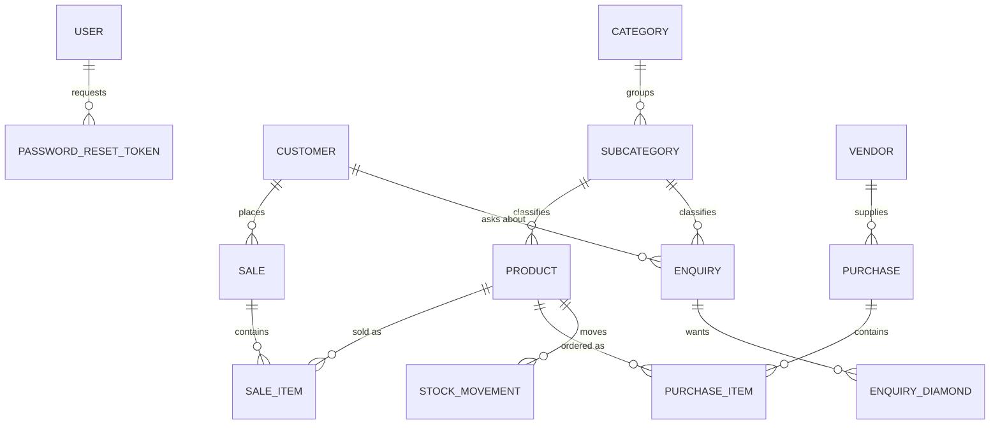

# Database Schema — Relationship Overview

> **Purpose:** The one file that shows every table, every relationship, and every enum in this system, so a new feature or migration starts from the real shape instead of guessing it from scattered `.service.ts` files.
>
> **Related docs:** `data-conventions.md` (the *rules* behind these fields — id format, money type, migration naming) · `../domains/*.md` (the *business rules* layered on top of these tables) · source of truth is always `prisma/schema.prisma` — **if this file and that one disagree, `schema.prisma` wins; fix this file** (see `../GOLDEN_RULES.md` Rule 8).
>
> **Reflects:** migration `20260925180000_flatten_product_diamond` (the latest as of this writing — check `prisma/migrations/` for anything newer before trusting this blindly).

---

## Entity-Relationship Diagram

`AttributeOption` (Metal/Diamond-Shape/Diamond-Quality picklists) is deliberately **not** an edge on this diagram — `Product` stores its `label` as a plain string, not a foreign key, so there is no DB relationship to draw. See its own section below and Rule 9 in `data-conventions.md` for why. `Product`'s own diamond fields are likewise not a separate edge — they're plain columns on `Product` itself (see below), not a child table, since a product has at most one diamond block.

Read this as: an arrow's "many" side (`o{`) is the table holding the foreign key. E.g. `SALE_ITEM` has both `saleId` and `productId` — it's the join between `SALE` and `PRODUCT`, carrying its own data (`quantity`, `unitPrice`, `lineTotal`) rather than being a bare join table.

## Tables, Field by Field

### `User` — login identity

| Field | Type | Notes |
|---|---|---|
| `id` | uuid, PK | |
| `name`, `email` (unique) | string | |
| `passwordHash` | string | bcrypt, never the raw password |
| `role` | `Role` enum | `ADMIN` \| `STAFF`, default `STAFF` |
| `refreshToken` | string, nullable | bcrypt hash of the current refresh token, `null` after logout — see `architecture/auth-and-authorization.md` |
| `createdAt`, `updatedAt` | timestamps | |

**Relationships:** has many `PasswordResetToken`.

### `PasswordResetToken` — one-time reset codes

| Field | Type | Notes |
|---|---|---|
| `id` | uuid, PK | |
| `userId` | uuid, FK → `User.id` | indexed |
| `codeHash` | string | bcrypt hash of the 6-digit code sent by email |
| `expiresAt` | datetime | 10 minutes from creation |
| `consumedAt` | datetime, nullable | set once the code is successfully verified — makes it single-use |
| `createdAt` | timestamp | |

### `Category` / `Subcategory` — product taxonomy

| Table | Key fields | Notes |
|---|---|---|
| `Category` | `id`, `name` (unique) | Top level. Cannot be deleted while it has subcategories (`inventory.service.ts` `deleteCategory`). |
| `Subcategory` | `id`, `name`, `categoryId` (FK) | `@@unique([categoryId, name])` — same subcategory name is fine under a different category. Cannot be deleted while it has products **or enquiries**. |

**Relationships:** `Category` has many `Subcategory`; `Subcategory` has many `Product` and `Enquiry`.

### `Product` — the jewelry costing sheet + sellable/stockable item

| Field | Type | Notes |
|---|---|---|
| `id` | uuid, PK | |
| `designNumber` | string, unique | Business-facing identifier, distinct from `id` — was `sku` before migration `20260924120000` |
| `name` | string | |
| `metalType` | string, nullable | Free-text, but populated from the `AttributeOption` (`type: METAL`) picklist by the UI — e.g. `"Gold"`, `"Silver"`. Nullable only because rows created before this migration have no value. |
| `grossWeight` | `Decimal(10,3)`, nullable | Gr.Wt in grams — 3 decimal places (finer than money) since jewelry weights need that precision |
| `metalRatePerGram` | `Decimal(10,2)`, nullable | Metal price per gram at the time this design was costed |
| `diamondShape` | string, nullable | Free-text, populated from `AttributeOption` (`type: DIAMOND_SHAPE`) — e.g. `"Round"`, `"Square"`. Null if the design has no diamond. |
| `diamondQuality` | string, nullable | Free-text, populated from `AttributeOption` (`type: DIAMOND_QUALITY`) — e.g. `"Q1"`, `"Q2"` |
| `diamondPieces` | int, nullable | Number of stones |
| `diamondCaratWeight` | `Decimal(10,3)`, nullable | Ct.Wt — the figure the price formula actually uses (`diamondCost = diamondCaratWeight × diamondRate`) |
| `diamondWeight` | `Decimal(10,3)`, nullable | A separate client-requested "final diamond weight" field, stored for reference only — **not** part of any calculation |
| `diamondRate` | `Decimal(10,2)`, nullable | Rate per carat |
| `makingChargePerGram` | `Decimal(10,2)`, nullable | Labour rate per gram |
| `fixedExpense` | `Decimal(10,2)`, default 0 | Flat additional cost folded into Total Cost |
| `sellingPrice` | `Decimal(10,2)` | The actual price used elsewhere in the system (sale line items snapshot this) — was `unitPrice` before migration `20260924120000`, manually entered by staff, not derived |
| `quantityInStock` | int, default 0 | Mutated only via `StockMovement`-paired writes — never edit this without also writing a movement row |
| `reorderLevel` | int, default 0 | Threshold for the "low stock" filter (`quantityInStock <= reorderLevel`) |
| `subcategoryId` | uuid, nullable FK | A product can exist with no subcategory assigned |
| `createdAt`, `updatedAt` | timestamps | |

**Relationships:** belongs to `Subcategory` (nullable); has many `SaleItem`, `PurchaseItem`, `StockMovement`.

**Computed, not stored** (see `domains/inventory-and-stock.md` for the formulas): `metalCost`, `diamondCost`, `labourCost`, `totalCost`, `taxAmount`, `finalAmount`. These exist only in `inventory.service.ts`'s `toProductDto()` output, never as columns — recomputed from the raw inputs above every time a product is read.

> **Not a child table.** A product has at most one diamond block (not a repeatable list), so its diamond fields sit directly on `Product` above rather than in a separate table — contrast with `Enquiry`/`EnquiryDiamond` below, where an enquiry genuinely can have several diamond wishes and so does use a child table. See `data-conventions.md` Rule 11 on when a repeatable child table earns its existence.

### `AttributeOption` — Metal/Diamond-Shape/Diamond-Quality picklists

| Field | Type | Notes |
|---|---|---|
| `id` | uuid, PK | |
| `type` | `AttributeType` enum | `METAL` \| `DIAMOND_SHAPE` \| `DIAMOND_QUALITY` |
| `label` | string | The exact string shown in the dropdown **and** the exact string saved onto `Product.metalType`/`diamondShape`/`diamondQuality` (or `EnquiryDiamond.shape`/`quality`) when picked |
| `sortOrder` | int, default 0 | Display order within a `type` |
| `createdAt` | timestamp | |

`@@unique([type, label])`. **No foreign key from `Product`/`EnquiryDiamond` into this table** — they copy the `label` string at entry time. This is deliberate: an admin can delete an option (e.g. retiring "Rose Gold") without that being a destructive operation for historical products — a deleted option only disappears from the picker for *new* entries, every product that already used it keeps showing that exact string forever. See `data-conventions.md` Rule 10 and the "Attribute Options" admin screen (`/settings/attributes` in the frontend) for how options are managed.

### `StockMovement` — append-only stock ledger

| Field | Type | Notes |
|---|---|---|
| `id` | uuid, PK | |
| `productId` | uuid, FK | |
| `type` | `StockMovementType` enum | `RESTOCK` \| `SALE` \| `ADJUSTMENT` |
| `quantity` | int | Positive for stock in (`RESTOCK`), **negative** for stock out (`SALE` — see `deductStockInTransaction` in `inventory.service.ts`) |
| `reason` | string, nullable | Free text, e.g. `"Sale SALE-2026-0001"`, `"PO PO-2026-0003"`, `"Initial stock"` |
| `createdAt` | timestamp | |

Never updated or deleted — it's a log. `quantityInStock` on `Product` is a running total that every movement must keep in sync with (always change both in the same transaction).

### `Customer`

| Field | Type | Notes |
|---|---|---|
| `id` | uuid, PK | |
| `name` | string | |
| `email`, `phone`, `address` | string, nullable | |
| `createdAt`, `updatedAt` | timestamps | |

**Relationships:** has many `Sale` and `Enquiry`. The frontend-facing `totalSales` field is a computed `_count.sales`, not a stored column (see `customers.service.ts`). Unlike `Subcategory`, `deleteCustomer` does **not** guard against either relation — a pre-existing gap (a customer with sales already hits a raw, unhandled FK error on delete), not something the `Enquiry` addition introduced; not fixed here, out of scope.

### `Enquiry` / `EnquiryDiamond` — recorded customer interest, no pricing

| Table | Key fields | Notes |
|---|---|---|
| `Enquiry` | `id`, `customerId` (FK), `subcategoryId` (nullable FK), `metalType` (string, from the `METAL` `AttributeOption`s), `grossWeight` (`Decimal(10,3)`) | Deliberately has **no cost/price fields at all** — this is "what the customer asked about," not a costed item. Becomes a real `Product` later only if someone builds that cost sheet by hand; there's no automatic conversion. |
| `EnquiryDiamond` | `id`, `enquiryId` (FK), `shape`, `quality` (both from the matching `AttributeOption` types), `pieces`, `caratWeight` (`Decimal(10,3)`) | Notably **lighter than `Product`'s diamond fields** — no `weight` reference field, no `rate`, no computed cost, since nothing here is being priced. Also, unlike `Product`, this genuinely is a child table — an enquiry can list several diamond wishes, replaced wholesale on update (`deleteMany` + nested `create`, same pattern `sales.service.ts`'s `updateSale` uses for `SaleItem`). |

**Relationships:** `Customer` has many `Enquiry`; `Subcategory` has many `Enquiry` (nullable — an enquiry can be vague about subcategory); `Enquiry` has many `EnquiryDiamond`.

### `Sale` / `SaleItem` — invoicing

| Table | Key fields | Notes |
|---|---|---|
| `Sale` | `id`, `saleNumber` (unique, e.g. `SALE-2026-0001`), `customerId` (FK), `status` (`SaleStatus` enum), `subtotal`/`tax`/`total` (`Decimal(10,2)`), `issuedAt` (nullable) | See `domains/sales-and-invoicing.md` for the full state machine |
| `SaleItem` | `id`, `saleId` (FK), `productId` (FK), `quantity`, `unitPrice`, `lineTotal` (all `Decimal` except `quantity`) | `unitPrice`/`lineTotal` are snapshotted at sale-creation time — changing `Product.unitPrice` later does not retroactively change existing sale items |

**Relationships:** `Customer` has many `Sale`; `Sale` has many `SaleItem`; `SaleItem` belongs to one `Product`.

### `Vendor` / `Purchase` / `PurchaseItem` — procurement

| Table | Key fields | Notes |
|---|---|---|
| `Vendor` | `id`, `companyName`, `contactPerson`/`email`/`phone`/`address` (nullable) | Cannot be deleted while it has purchases |
| `Purchase` | `id`, `purchaseNumber` (unique, e.g. `PO-2026-0001`), `vendorId` (FK), `status` (`PurchaseStatus` enum), `vendorInvoiceNumber`/`vendorInvoiceDate` (both nullable — the vendor's own bill number/date, recorded once known), `orderedAt`/`receivedAt` (nullable) | See `domains/purchases-and-vendors.md` for the state machine. No stored subtotal/total — computed from items at read time (`purchases.service.ts` `toDto`). |
| `PurchaseItem` | `id`, `purchaseId` (FK), `productId` (FK), `quantity`, `receivedQuantity` (default 0), `unitCost`, `lineTotal` | `receivedQuantity` tracks partial fulfillment — see the purchases domain doc |

**Relationships:** `Vendor` has many `Purchase`; `Purchase` has many `PurchaseItem`; `PurchaseItem` belongs to one `Product`.

## Enums

| Enum | Values | Owning table |
|---|---|---|
| `Role` | `ADMIN`, `STAFF` | `User.role` |
| `StockMovementType` | `RESTOCK`, `SALE`, `ADJUSTMENT` | `StockMovement.type` |
| `SaleStatus` | `DRAFT`, `ISSUED`, `PAID`, `CANCELLED` | `Sale.status` |
| `PurchaseStatus` | `DRAFT`, `ORDERED`, `PARTIALLY_RECEIVED`, `RECEIVED`, `CANCELLED` | `Purchase.status` |
| `AttributeType` | `METAL`, `DIAMOND_SHAPE`, `DIAMOND_QUALITY` | `AttributeOption.type` |

## Cross-Cutting Rules That Apply to Every Table

1. Every primary key is a `String` UUID via `@default(uuid())` — never an auto-increment int. See `data-conventions.md`.
2. Every money field is `Decimal(10,2)` in the DB and converted to a plain `Number` at the DTO boundary (services do `Number(field)` before returning JSON) — the frontend never sees a `Decimal` object.
3. Nothing in this schema is soft-deleted — `delete` operations are real `DELETE`s, guarded by service-layer checks that block deletion while dependent rows exist (categories with subcategories, vendors with purchases, etc.). If soft-delete is ever needed, it's a schema change (an `deletedAt` column) plus a service-layer filter change everywhere that model is queried — not a small addition.
4. No table has a generic `metadata`/`extra` JSON column — every field the app needs is a named column. Keep it that way; an untyped catch-all field defeats Prisma's type safety.

## Migration History (Chronological)

| Migration | What it did |
|---|---|
| `20260708180358_init` | Initial schema: `User`, `Customer`, `Category`, `Product`, `StockMovement`, `Invoice`/`InvoiceItem` (later renamed), `Role`/`StockMovementType`/`InvoiceStatus` enums |
| `20260722000000_rename_invoice_to_sale` | Renamed `Invoice`→`Sale`, `InvoiceItem`→`SaleItem`, `InvoiceStatus`→`SaleStatus` — the domain term settled on "Sale," not "Invoice" |
| `20260723040802_add_password_reset_token` | Added `PasswordResetToken` for the email-code reset flow |
| `20260728000000_add_subcategory` | Inserted `Subcategory` between `Category` and `Product` (products used to hang directly off `Category`) |
| `20260730185017_add_vendor_purchase_models` | Added `Vendor`, `Purchase`, `PurchaseItem`, `PurchaseStatus` — the procurement side of the system |
| `20260924120000_add_jewelry_costing_fields` | Renamed `Product.sku`→`designNumber`, `unitPrice`→`sellingPrice`; dropped `Product.description`; added the metal/labour costing fields, `ProductDiamond`, and `AttributeOption`/`AttributeType` — repositioned the catalog from generic inventory items to a jewelry cost sheet |
| `20260925090000_add_purchase_vendor_invoice_fields` | Added `Purchase.vendorInvoiceNumber`/`vendorInvoiceDate`, both nullable |
| `20260925160000_add_enquiries` | Added `Enquiry`/`EnquiryDiamond` — a pricing-free record of customer interest |
| `20260925180000_flatten_product_diamond` | Dropped `ProductDiamond`; added `diamondShape`/`diamondQuality`/`diamondPieces`/`diamondCaratWeight`/`diamondWeight`/`diamondRate` directly onto `Product` — a product has exactly one diamond block, not a repeatable list |

When adding a table or relationship, add a row here in the same change (see `../GOLDEN_RULES.md` Rule 8) — this table is what makes "why does this table look this way" answerable in ten seconds instead of a `git log` archaeology session.
